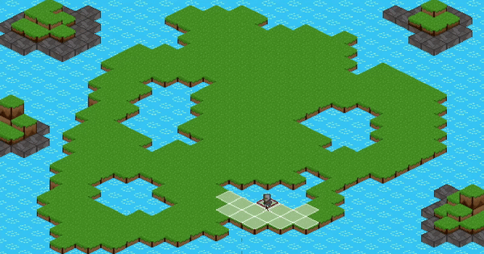

# Point-and-click gridbased movement system in 2D isometric perspective
This project is a "point-and-click" player character movement system on a two-dimensional isometric gridbased map.
Presented project was created with the intention of using it as a base for turn-based games.

## Features
1. Grid generation:
Script creates nodes based on walkable tilemap at the beginning of runtime.
2. Implemented pathfinding:
The movement system calculates shortest path from player's current position to selected node based on implemented [A* pathfinding algorithm](https://en.wikipedia.org/wiki/A*_search_algorithm).
3. Move guide visualisation:
During each turn, nodes available for move on them are highlighted, to visualise the available movement area for that turn.

## My package
Here is a link for my custom package, which i used in this project:
https://github.com/Skallu0711/Skallu-Utils
